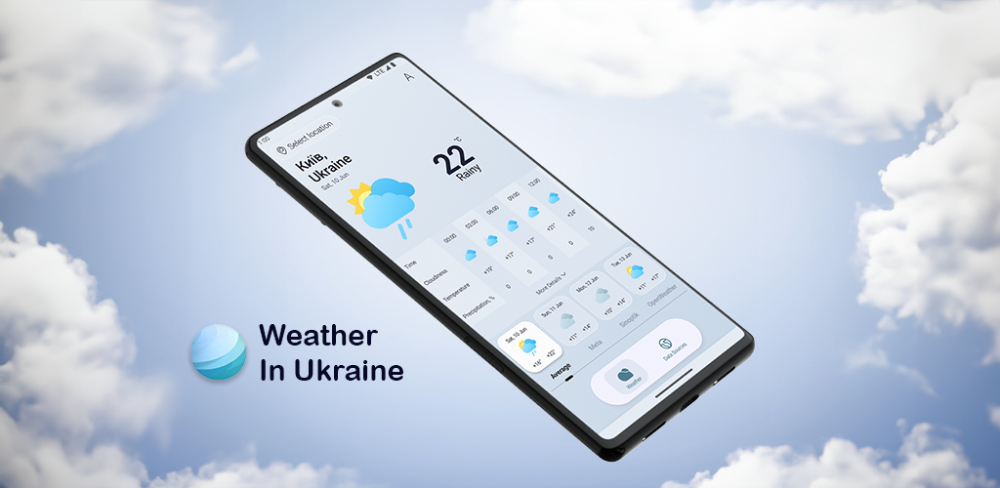
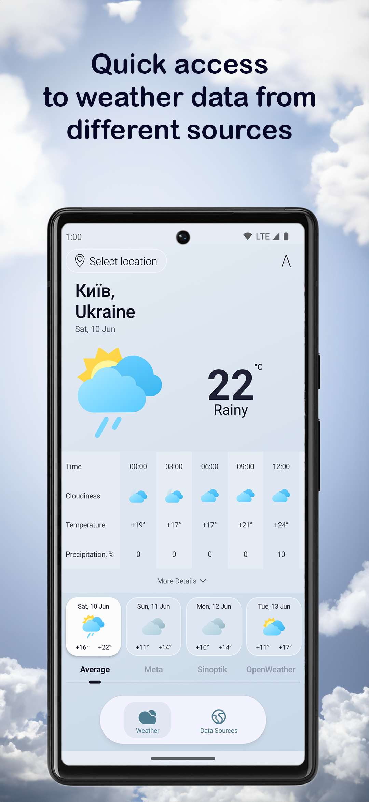
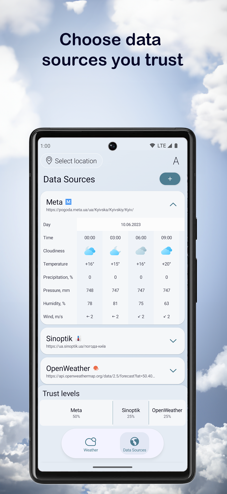
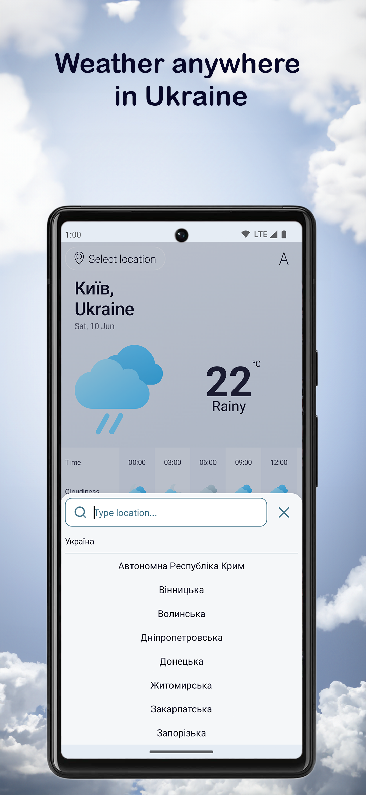
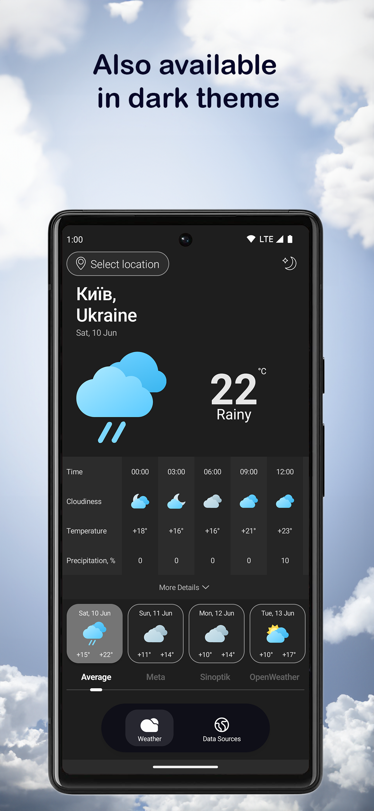

# Weather in Ukraine
An app to collect, average out and display the weather information from different weather sites in Ukraine and OpenWeather API

[](LICENSE)

## Features
- Displaying weather data from different sources
- Easy way to compare weather data between all sources 
- Averaging out the data to make a forecast you trust
- Setting trust levels for each data source to influence the averaged result
- Night mode support

## Overview
### Weather forcast screen



### Data source selection screen



### Location selection menu



### Night mode



## Technologies used to make an app
- [Kotlin](https://kotlinlang.org/)
- MVVM Architecture pattern
- [Room](https://developer.android.com/training/data-storage/room) local database
- [Dagger-hilt](https://dagger.dev/hilt/) for dependency injection
- [Retrofit](https://square.github.io/retrofit/) for access to OpenWeather API
- [Jetpack Compose](https://developer.android.com/jetpack/compose) for the UI
- [Compose Navigation](https://developer.android.com/jetpack/compose/navigation)
- [Accompanist libraries](https://google.github.io/accompanist/) for UI components which are not yet available in default Jetpack Compose collection
- [Data store](https://developer.android.com/topic/libraries/architecture/datastore) for saving preferences
- [Jsoup](https://jsoup.org/) library for parsing web pages
- [Gson](https://github.com/google/gson) to work with JSON files

## License
```
MIT License

Copyright (c) 2023 bogdan801

Permission is hereby granted, free of charge, to any person obtaining a copy
of this software and associated documentation files (the "Software"), to deal
in the Software without restriction, including without limitation the rights
to use, copy, modify, merge, publish, distribute, sublicense, and/or sell
copies of the Software, and to permit persons to whom the Software is
furnished to do so, subject to the following conditions:

The above copyright notice and this permission notice shall be included in all
copies or substantial portions of the Software.

THE SOFTWARE IS PROVIDED "AS IS", WITHOUT WARRANTY OF ANY KIND, EXPRESS OR
IMPLIED, INCLUDING BUT NOT LIMITED TO THE WARRANTIES OF MERCHANTABILITY,
FITNESS FOR A PARTICULAR PURPOSE AND NONINFRINGEMENT. IN NO EVENT SHALL THE
AUTHORS OR COPYRIGHT HOLDERS BE LIABLE FOR ANY CLAIM, DAMAGES OR OTHER
LIABILITY, WHETHER IN AN ACTION OF CONTRACT, TORT OR OTHERWISE, ARISING FROM,
OUT OF OR IN CONNECTION WITH THE SOFTWARE OR THE USE OR OTHER DEALINGS IN THE
SOFTWARE.

```
